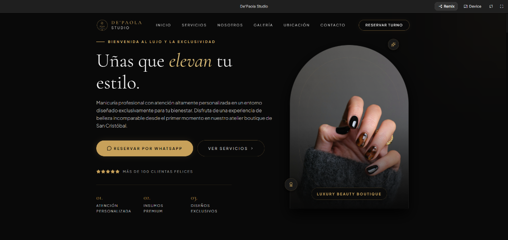

<div align="center">

</div>


# De'Paola Studio - Web Profesional de Manicuría & Nail Art

Una plataforma web de alta gama y diseño premium para **De'Paola Studio**, un salón boutique de manicuría profesional y diseño de uñas. La aplicación combina una estética visualmente impactante, animaciones fluidas y características interactivas para ofrecer una experiencia de usuario del más alto nivel.

---

## 🌟 Características Clave

- 💎 **Diseño Premium & Micro-interacciones**: Paleta de colores sofisticada en tonos oscuros (`#090909`), detalles en dorado/bronce (`#C8A15A`) y tipografía refinada que reflejan la exclusividad de la marca.
- 🎛️ **Simulador / Estimador Interactivo de Sesiones**: Herramienta interactiva que permite a las clientas seleccionar múltiples servicios (Semi-Permanente, Kapping Gel, Nail Art Exclusivo, etc.) para armar su combo a medida.
- 📅 **Integración Inteligente con WhatsApp**: Reserva automatizada que pre-redacta mensajes dinámicos con el servicio seleccionado o los combos personalizados armados en el simulador.
- 🖼️ **Galería Dinámica Filtrable**: Visualización de trabajos reales organizados por categorías (Nail Art, Kapping Gel, Semi Permanente) con un diseño visual impecable.
- 💬 **Testimoniales & Confianza**: Sección dedicada para mostrar valoraciones reales de clientes satisfechos.
- 🗺️ **Ubicación Interactiva & Contacto**: Formulario integrado y enlace directo a la ubicación para facilitar la llegada de nuevos clientes.

---

## 📂 Estructura del Proyecto

El proyecto sigue una estructura limpia y optimizada basada en React y Vite:

```bash
depaola-studio/
├── .env.example              # Plantilla para variables de entorno (ej. APIs)
├── index.html                # Punto de entrada HTML5 principal con fuentes personalizadas
├── package.json              # Script y dependencias del proyecto
├── tailwind.config.js        # Configuración de Tailwind CSS
├── tsconfig.json             # Configuración de TypeScript
├── vite.config.ts            # Configuración del bundler Vite
├── src/                      # Directorio del código fuente
│   ├── main.tsx              # Inicialización de React y renderizado principal
│   ├── App.tsx               # Componente raíz que maneja el diseño general y las secciones
│   ├── index.css             # Estilos globales y directivas de Tailwind CSS
│   ├── assets/               # Imágenes, logotipos y recursos multimedia locales
│   ├── components/           # Componentes modulares y reutilizables
│   │   └── Logo.tsx          # Componente SVG vectorial interactivo para la identidad de marca
│   └── data/                 # Capa de datos estáticos y lógica simulada
│       └── dataSet.tsx       # Datos de servicios, testimonios, galería y beneficios
```

---

## 🛠️ Tecnologías Utilizadas

- **Frontend**: React 19, TypeScript
- **Estilos & Diseño**: Tailwind CSS v4 (con configuraciones personalizadas y efectos de desenfoque de fondo/backdrop blur)
- **Iconos**: Lucide React
- **Compilación / Bundler**: Vite 6
- **Animaciones**: Motion / Framer Motion para transiciones suaves

---

## 🚀 Ejecución y Despliegue Local

### Requisitos Previos

- Tener instalado **Node.js** (versión 18 o superior recomendada).

### Pasos para iniciar el desarrollo

1. **Instalar Dependencias:**
   ```bash
   npm install
   ```

2. **Configurar Variables de Entorno:**
   Crea una copia de `.env.example` con el nombre `.env.local` y configura tus variables de entorno si son necesarias:
   ```bash
   cp .env.example .env.local
   ```

3. **Iniciar el Servidor de Desarrollo:**
   ```bash
   npm run dev
   ```
   La aplicación estará disponible en [http://localhost:3000](http://localhost:3000).

4. **Compilar para Producción:**
   ```bash
   npm run build
   ```

